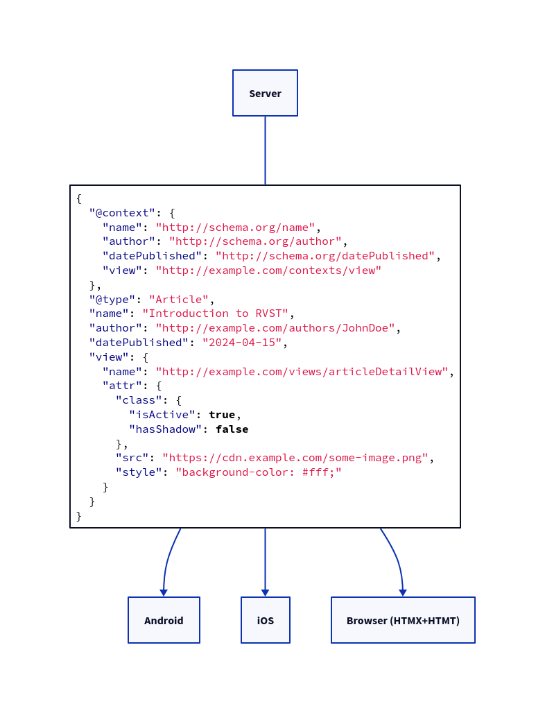

# Representational View State Transfer (RVST)
Representational View State Transfer (RVST) is a standard that follows the REST principles for server side view state
management across web, mobile, and desktop platforms.

## Introduction
RVST is main *raison-d'être* is to lessen the size and complexity of the front end in any client environment.

With the same payload an Android, iOS, Browser 
([HTMX](https://htmx.org/)+[HTMT](https://github.com/RepresentationalViewStateTransfer/HTMT)) or even desktop 
application can be informed on what needs to display and how.

*This flow chart gives a visual reference of how one payload can be passed to any client environment*

## Getting Started
This repository serves as the working draft for the RVST standard. It also includes the 
[JSON-Schema for version 1](./schemas/rvst.v1.schema.json) and [example implementations](./examples) which you can use 
as a basis for your integration tests.

## Key Concepts
For a deeper dive into RVST's principles, see our 
[concepts and principles documentation](/docs/concepts-and-principles.md).

## Contributing
We encourage contributions from the community! Please read our [CONTRIBUTING guidelines](CONTRIBUTING.md) to learn how 
you can help improve RVST.

## Community and Support
Join our community forums or get support by visiting [Community Support](LINK_TO_SUPPORT).

## License
Representational View State Transfer (RVST) is released under the MIT License. For more details, see the 
[LICENSE](LICENSE) file.
