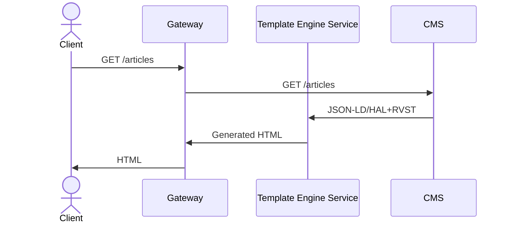
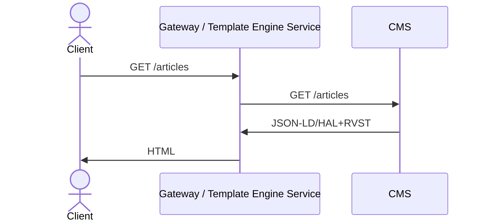
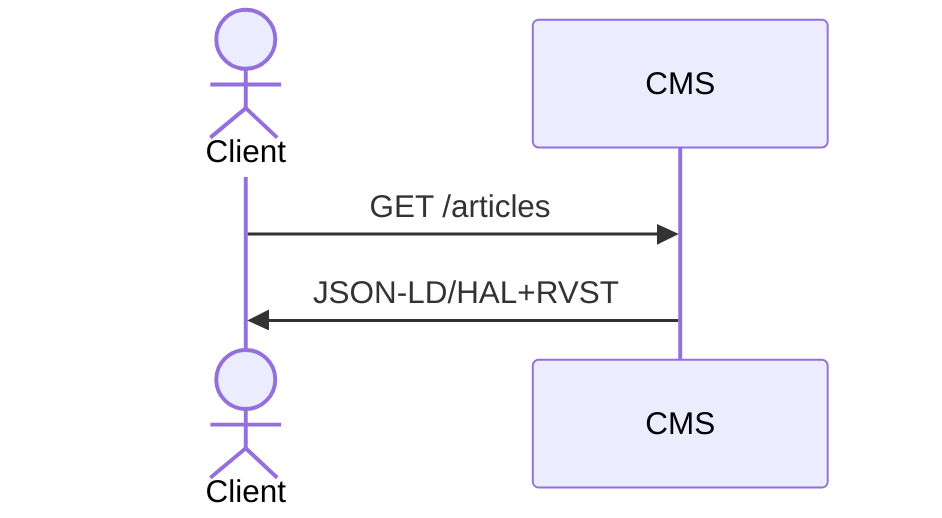
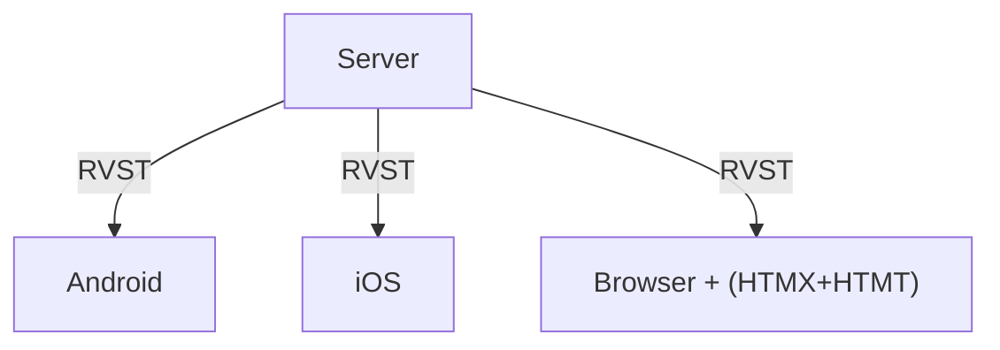

# Patterns

```mermaid
sequenceDiagram
  actor C as Client
  participant Gateway
  participant Template as Template Engine Service
  participant CMS as CMS

  C->>Gateway: GET /articles
  Gateway->>CMS: GET /articles
  CMS->>Template: JSON-LD/HAL+RVST
  Template->>Gateway: Generated HTML
  Gateway->>C: HTML
```

```mermaid
sequenceDiagram
  actor C as Client
  participant Template as Gateway / Template Engine Service
  participant CMS as CMS

  C->>Template: GET /articles
  Template->>CMS: GET /articles
  CMS->>Template: JSON-LD/HAL+RVST
  Template->>C: HTML
```

```mermaid
sequenceDiagram
  actor C as Client
  participant CMS as CMS

  C->>CMS: GET /articles
  CMS->>C: JSON-LD/HAL+RVST
```

```mermaid
graph TD;
    Server[Server] --> |RVST| Android[Android];
    Server[Server] --> |RVST| iOS[iOS];
    Server[Server] --> |RVST| Browser["Browser + (HTMX+HTMT)"];
```
